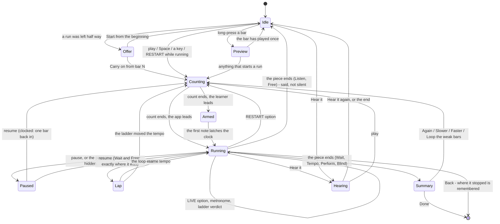

# The score screen's state machine, as it is and as it should be (T31, 2026-09-23)

The owner: *"re-examine the state machines for playing, listening and other stuff from stop,
start and option changes. It's very confusing what happens and I don't think it's been fully
explored."*

Restated without those words: **at every moment this screen can be in, for every control and
every signal that can arrive, say where it lands and what it tells the learner — and find the
moments where it lands somewhere nobody could have predicted, or says nothing, or says
something that is not true.**

`score.fuzz.spec.ts` walks random paths and checks what must hold whatever happened. Nobody
had written the table down. This is the table, the diagram of what it should be, the seven
faults it found and the five choices it cannot make.

---

## 0. How each cell was filled, and which is which

Two sources, and every cell below carries its mark:

- **M** — **measured**, by `app/tests/e2e/score.states.spec.ts`, which puts the screen in a
  named state, fires one event, and records `#score-waiting`, `#score-status`, the transport
  button's label, the Loop control's label and the engine's own fields through
  `window.__pianopath.scoreRun()`. Thirty-five cells, on `song.folk.mary-had-a-little-lamb`
  at 390x844 with a mocked MIDI piano. The probe's output is printed by the test.
- **C** — **read out of the code**, with the deciding line named.

**What is a proxy here.** Every M cell is a reading of the DOM and of the engine's state
object. That is a proxy for what a learner sees, and a poor one for what a learner *hears*:
**nothing in this work was listened to.** The metronome, the played-back hand, the count-in
clicks and the latch's "the app's note sounds on your key" are all unheard, and every claim
about them below is C. A line being in `#score-waiting` is also not the same as a line being
legible: `04` §5f ellipsises that element, and at 342 px one standing line is already cut.

---

## 1. The rows — every state the screen can be in

Eleven are named in the code; the rest are states the code keeps without naming.

| # | state | how you get there | how the code knows |
|---|---|---|---|
| R1 | **idle at bar 1** | the piece opens, or a run stops | `session === null` or `!session.running` |
| R2 | **idle with a run left half way** | reopening a piece torn down mid-run | `#score-resume`, `unfinishedFor(itemId)` |
| R3 | **counting in** | `▶` in Keep tempo or Listen | `musicMs < 0`; `tempoTick.isCountIn` |
| R4 | **armed** (holding for the first note) | the count-in ends and the learner leads | `engine.state.armed` |
| R5 | **running — Wait** | `▶`, a key, or Space | `engine.mode === 'wait'` |
| R6 | **running — Keep tempo** | as above | `engine.mode === 'tempo'` |
| R7 | **running — rhythm only** | R6 with the `⋯` row on | `engine.judgingRhythmOnly` |
| R8 | **running — Listen** | the selector | `engine.mode === 'listen'`, `hearing === false` |
| R9 | **running — Free** | the selector | `engine.mode === 'free'` |
| R10 | **running — Perform** | `?performance=1` | `performanceRun`, over whatever mode |
| R11 | **running — Blind** | `?blind=1` | `blind`, over whatever mode |
| R12 | **paused** | `⏸`, or the page hidden in a clocked mode | `engine.state.paused` |
| R13 | **loop running** | a loop is set | `prepared.firstStep/lastStep` narrowed |
| R14 | **ladder step** | R13 with the Ladder row on | between `finished{loop}` and the restart |
| R15 | **hearing (`Hear it`)** | the bar's `Hear it` | `hearing === true`, engine mode `listen` |
| R16 | **one-bar preview** | long-press a bar | `hearingBar !== null`, engine mode `listen` |
| R17 | **page hidden mid-run** | the phone locks | R12 plus `awaySeconds` |
| R18 | **summary** | a run ends by itself | `#score-summary` shown, no run |
| R19 | **refused start** | a hand the piece has nothing for | no run, a sentence on `#score-status` |
| R20 | **sideways twin** | the phone is turned | `data-chrome`; the header is not drawn |

R20 is not a state of the run: the same machine draws Back, the title and the state line at
the bar's left end instead of in the header (`04` §5). It differs in exactly one way that
matters here — **one slot for two lines** — so where `#score-status` and `#score-waiting`
both have something to say, sideways shows only the run's (`syncBarLeft`, which asks
`helpStrip.isDefaultNow()`). Every fault below that was *two sentences disagreeing* was
therefore a fault sideways as well, and a worse one, because only one of them was drawn.

---

## 2. The columns — every event

Thirty-five events — every control on the bar, every row in the `⋯` sheet, and every signal
that can arrive. Sixteen of them fall into two groups that behave identically, and each group
is enumerated rather than left as a plural:

- **RESTART**, eleven controls with one behaviour (`if (session?.running) startRun()`): mode,
  hands, Loop (set and clear counted as one), Section, the tempo slider (on `change`), the
  typed bpm, Rhythm only, Duet, Bars in window, Layout, and **Input** (new, §6.4).
- **LIVE**, five that never touch the run: Size, Keys, Sound, Metronome, Ladder.
- Nineteen keep their own identity: `▶`/`⏸`, `Start again`, `Hear it`, long-press a bar, a
  MIDI note expected, wrong and early (three), a mic note, the metronome tick, the loop end,
  the piece end, page hidden, page shown, rotation, `← Back`, reopening the piece, Space,
  Blind, Perform.

**The table below draws fourteen columns**, not thirty-five: the two groups become two, and
six of the nineteen — a mic note, Space, Blind, Perform, reopening the piece and long-pressing
a bar — are written into the rows they belong to rather than given a column of dashes. A mic
note is never a measured cell anywhere in this document (§8).

---

## 3. The table as it is

`→` is the state it lands in; the words after it are what the screen said. **Bold** markers:
**U** undefined (no code path), **S** surprising (the state changed and nothing said so),
**I** inconsistent (the state line, the button and the engine disagree), **L** lossy (a run's
progress thrown away without saying so). A cell with no marker was correct before this work.

| from \ event | ▶ / ⏸ | Start again | Hear it | RESTART group | LIVE group | expected note | wrong note | metronome tick | loop end | piece end | page hidden | page shown | rotate | Back |
|---|---|---|---|---|---|---|---|---|---|---|---|---|---|---|
| **R1 idle** | → R3/R5 *readyLine* **M** | → R3/R5 **C** | → R15 **M** | stays R1, no run **M** | stays R1 **C** | → R5, note played in **M** | → R5 **C** | — | — | — | nothing **C** | nothing **C** | refit **C** | leaves **C** |
| **R2 resume offer** | → run from the offered bar **C** | → R1 **C** | → R15 **C** | offer redrawn **C** | — | → run at bar 1, the offer hides **C** | as R1 | — | — | — | — | — | offer survives **C** | leaves **C** |
| **R3 counting in** | → R12 **C** | → R3 **C** | → R15, run lost **L M** | → R3 restarted **C** | live **C** | ignored, not judged (`latch`) **C** | ignored **C** | count drawn **C** | — | — | → R12 **M** | R12 + away **M** | refit **C** | leaves, remembered **C** |
| **R4 armed** | → R12, holding kept **M** | → R3 **C** | → R15, run lost **L C** | → R3 **C** | Metronome refused, button says On **I C** | → R6, latched **M** | latches too **C** | none while armed **C** | — | — | → R12 **M** | R12 + away **M** | refit **C** | leaves **C** |
| **R5 running Wait** | → R12 **M** | → R5 **C** | → R15, run lost **L M** | → R5 restarted **M** | live **C** | advances **M** | red, strict retries **C** | — | → R13 lap **C** | → R18 **C** | nothing, by design **M** | nothing **M** | refit **C** | leaves, remembered **C** |
| **R6 running Tempo** | → R12 **M** | → R6 **C** | → R15, run lost **L C** | → R6 restarted **M** | live **C** | hit/early/late **C** | extra note **C** | dot pulses **C** | → R13 **C** | → R18 **C** | → R12 **C** | R12 + away **C** | refit **C** | leaves **C** |
| **R7 rhythm only** | as R6 | as R6 | as R6 | as R6, line re-said **C** | as R6 | any key settles **C** | extra key **C** | as R6 | as R6 | → R18 *Rhythm run* **C** | as R6 | as R6 | as R6 | as R6 |
| **R8 running Listen** | → R12 **C** | → R8 **C** | → R15 **C** | → R8 **C** | live **C** | ignored (`feed` returns) **C** | ignored **C** | dot **C** | → R13 **C** | → R1 *Played to the end.* **C** | → R12 **C** | R12 + away **C** | refit **C** | leaves, **not** remembered **C** |
| **R9 running Free** | → R12 **M** | → R9 **C** | → R15 **C** | → R9 **C** | Metronome refused, button says On **I C** | page turns **C** | nothing marked **C** | — | — | → R1 *End of the piece.* **C** | nothing **C** | nothing **C** | refit **C** | leaves **C** |
| **R10 Perform** | as its mode; no `Start again` row **C** | absent **C** | → R15, the performance is gone **L C** | loop and ladder refused **C** | live **C** | as its mode | as its mode | as its mode | n/a | → R18 `performance` **C** | → R12, shorter sentence **C** | as R6 | refit **C** | leaves **C** |
| **R11 Blind** | as its mode **C** | as its mode | as its mode | as its mode | as its mode | judged, unseen **C** | judged **C** | as its mode | as its mode | → R18, not tagged blind **C** | as its mode | as its mode | as its mode | as its mode |
| **R12 paused** | → back to the run **M** | → R3/R5 **C** | → R15, run lost **L C** | → R3/R5 restarted, **playing again M** | Metronome refused, button says On **I C** | **dropped in silence M** | dropped **C** | none **C** | — | — | already paused **C** | already paused **C** | refit **C** | leaves, remembered **C** |
| **R13 loop running** | as its mode | as its mode | as its mode | clear → restarts unlooped **M** | Ladder live **C** | as its mode | as its mode | as its mode | lap: colours cleared **C** | n/a **C** | as its mode | as its mode | as its mode | as its mode |
| **R14 ladder step** | as R6 | as R6 | ladder ignored **C** | as R6, ceiling raised **C** | as R6 | as R6 | counts against the pass **C** | as R6 | verdict said, tempo moved **C** | n/a | as R6 | as R6 | as R6 | as R6 |
| **R15 hearing** | → the chosen run **M** | → the demonstration again **S C** | → R1 **M** | restarts as Listen **C** | live **C** | ignored **C** | ignored **C** | dot **M** | lap **C** | → R1 *Played to the end.* **C** | → R12 **M** | R12 + away **M** | refit **C** | leaves; **remembered as a run left half way I C** |
| **R16 bar preview** | → the chosen run **C** | → the chosen run **C** | → R1 **C** | → the chosen run **C** | live **C** | ignored **C** | ignored **C** | dot **C** | → R1, loop given back **C** | → R1 **C** | → R12 **C** | R12 + away **C** | refit **C** | leaves; **remembered I C** |
| **R17 hidden** | — | — | — | — | — | — | — | — | — | — | — | → R12 + away **M** | — | leaves **C** |
| **R18 summary** | *Again* → a run **C** | — | → R15 **C** | no run, sheet stays over stale numbers **S C** | live **C** | ignored (`endedSinceLastStart`) **C** | ignored **C** | — | — | — | nothing **C** | nothing **C** | refit **C** | leaves, forgotten **C** |
| **R19 refused** | tries again, refused again **C** | as ▶ **C** | → R15 **C** | a hand that works starts a run **M** | live **C** | tries, refused **C** | — | — | — | — | nothing **C** | nothing **C** | refit **C** | leaves **C** |

**The counts.** 20 rows x 14 columns = 280 cells; 35 measured, the rest read. Marked:

- **undefined — 0.** Every event has a code path in every state. The two that looked
  undefined were reachable dead ends, not missing branches, and are counted as U-shaped
  faults under I and L below: the **stranded bar preview** (R16 with its loop removed:
  `onFinished` returned without ending it, so `hearingBar` stayed set for the rest of the
  visit) and the **run armed for ever** (R4 with Input set to *None*).
- **surprising — 2.** R15 + *Start again* (it restarts the demonstration rather than the run
  you chose — `startRun` clears a preview but not `hearing`), R18 + a RESTART control (the
  sheet keeps showing a score for settings that have changed).
- **inconsistent — 7.** R12's state line (fixed), R15's state line (fixed), R4/R9/R12 +
  Metronome (the button says On and nothing clicks — **a choice, see §7**), R16 stranded
  (fixed), R4 + Input (fixed), R15/R16 + page hidden (fixed), R15/R16 + Back (a demonstration
  written down as a run left half way — fixed).
- **lossy — 6.** Every `Hear it` from a run (R3, R4, R5, R6, R10, R12): the run is ended,
  nothing says so, and nothing puts it back. **A choice, see §7.**

Two more faults the table found that are not in the state x event grid, because they are
about a sentence outliving the state that wrote it:

- **the refused hand** (R19): the screen said *choose R or Both* and pressing either did
  nothing, because the hand buttons only restart a run that is going and the refusal had just
  stopped the only one there was. The sentence then stayed on the header for the rest of the
  sitting. **M**, fixed.
- **the loop prompt**: *Loop start: bar 1. Double-tap the last bar.* was still on the header
  after the loop had been set, and stayed through a cleared loop, a mode change and a pause —
  measured across nine later probe cells. **M**, fixed.

**One thread runs through four of the seven.** The screen kept asking the **mode selector**
what was going on when the thing it needed to know was what the **run** was doing, and `Hear
it` exists precisely to make those two disagree (`04` §5: it does not move the selector). The
beat dot, the page-hidden pause, the resume offer written on the way out and the state line
were each written independently and each asked the wrong one.

---

## 4. Where the documents and the table disagreed

| the document | the table | which is right, and why |
|---|---|---|
| `05` §4: *a running Tempo or Listen run pauses* when the page is hidden | `onVisibilityChange` asked the **selector**, so `Hear it` and the one-bar preview — Listen runs both — carried on into a locked phone **M** | the document. `05` §4's reason is a clock that stops getting frames, and those two have one. Fixed; `05` §4 now says *the run's mode, not the selector's*. |
| `04` §5f: the state line is *"written by whatever already knows the run"* | the line was written by the **mode selector** whenever the run had nothing specific to say, so a paused run read *The count-in clicks, then play along* and a `Hear it` run read *Play the first note. Nothing moves until you do.* **M** | the document. A standing line is the right fallback for *no run*; it is not a fallback for *a run doing something the fallback contradicts*. Fixed. |
| `04` §5: *"Every control that changes what is judged restarts the run — the mode, the hands, the loop, the section, Rhythm only, Duet"* | **Input** changes five judging options (`accuracyEstimated`, `micChordLeniency`, `micChordFraction`, `wrongNoteConfidence`, `latchStart`) and restarted nothing **C** | the document's rule, against its own list. Input is now the twelfth member and `04` §5 names it. |
| `04` §5: *"`⏮` ... `▶` from stopped already starts from the beginning"* and `05` §3b on holding | nothing anywhere said **paused** | the learner. `00` §1: a control that looks live and is not is a bug, and a screen that says *play the first note* while dropping every note played is that bug wearing words. |
| `05` §3b: the click is refused in four states | true, and the **button still reads On** in all four **C** | neither, yet. The engine's refusal is right; whether the row should be gone, say why, or gain a click of its own in Free play is the owner's (§7). |

Nothing in the table contradicted `05` §2, §3, §3a or §6: Wait's matching, Tempo's windows,
rhythm-first and the ladder all did what those sections say, in every cell that reached them.

---

## 5. The machine as it should be

### The principles, stated so a cell can be judged against them

1. **Nothing starts or restarts unasked** (`00` §1).
2. **An option changed mid-run does one of three things, and the screen says which in words:**
   it applies **live**, it **restarts** with a count-in, or it is **refused** until the run
   stops.
3. **A run's progress is never lost silently.** Either it is kept, or the screen says it has
   gone, or it is offered back.
4. **`Hear it` and a run are never both going.**
5. **The button that stops a thing is the one that started it.**
6. **The state line says what the run is doing** — not what the selector says it would do.

### The diagram

`Counting` is `Running` with no count-in where the mode has none (Wait and Free), which is
why the diagram has no separate arrow for them.

### Which of the three each option should be

| option | today | should be | why |
|---|---|---|---|
| **mode** | restart | **restart** | the whole judging rule changes; a run cannot carry half of each |
| **hands** | restart | **restart** | changes what is asked for *and* what the app plays under it |
| **loop** (set/clear) | restart | **restart** | the run's extent is the run |
| **section** | restart | **restart** | a loop with a name |
| **tempo** (slider `change`, bpm) | restart | **restart** | every `tStep` moves; judging against the old table would be judging a different piece |
| **ladder** | live | **live** | it acts at a lap boundary and never at the moment it is pressed; the tempo label is underlined so the number moving says it was asked for |
| **metronome** | live | **live**, and say when it is refused | the click is heard and never judged (T23). The four refusals are right; the silence about them is not (§7) |
| **input** | nothing → **restart** | **restart** | five judging options and the latch come from it; §6.4 |
| **layout** | restart | **restart** | a re-engraving recreates every element the judgements are keyed to (`08` §8.3) |
| **bars in window** | restart | **restart** | same, and it already refuses a press that would change nothing |
| **size** | live | **live** | `setZoom` never re-engraves, so nothing the run is keyed to moves |
| **keys** (strip/ribbon/off) | live | **live** | a view of the run, not part of it |
| **sound** (destination) | live | **live** | where the playback comes out |
| **duet** (`playbackHands`) | restart | **restart** | it decides whether the learner leads, which decides whether the run may hold for a first note (`learnerLeads`) |
| **perform** | route, run lost | **refused until the run stops** — a choice (§7) | a performance is a claim about one pass; turning one on mid-practice cannot make the practice into it |
| **blind** | route, run lost | **refused until the run stops** — a choice (§7) | the same, and the run so far was read from a page |
| **rhythm only** | restart | **restart** | it is exactly *what is judged* |

---

## 6. The fixes, each seen red first

All seven are in `app/src/ui/screens/ScoreScreen.ts`, with two cheap getters added beside them
— `PracticeEngine.isPaused` and `ScoreSession.paused`, so that asking "is this run paused"
once per painted frame does not build a `SessionScore` to answer. The tests are
`app/tests/e2e/score.states.spec.ts` (new, nine tests), one updated assertion in
`app/tests/e2e/score.screen.spec.ts` and one in `app/tests/unit/scoreMidRunSettings.test.ts`
— whose `ScoreSession` **stub** had to be taught `mode` and `paused`, because a stub is a
consumer of a field like any other (`00` §2.15).

### 6.1 A paused run says it is paused

`readyLine()` returns `''` while `session.running` is true — and it is true while paused — so
the help strip fell back to the mode's standing line. `PracticeEngine.feed` meanwhile returns
at `this.paused`, dropping every note. The screen was asking for the one thing it was
ignoring. New `pausedLine()`, first in `drawWaitingFor`'s order, and it carries the away time
so `05` §4's sentence is said once and in the one place the state line already is (it used to
be on `#score-status`, beside a state line contradicting it, and sideways only one of the two
is drawn).

*Red:* `a paused run showed the mode's standing line: "Play the first note. Nothing moves
until you do."` and the same for `"The count-in clicks, then play along."`

### 6.2 A demonstration says it is one

`Hear it` deliberately leaves the selector alone (`04` §5), and the state line read the
selected mode's standing sentence while the app played the piece. New `hearingLine()`.

*Red:* the same assertion as 6.1, from the probe's `running/wait | Hear it` cell.

### 6.3 A one-bar preview can no longer strand the screen

`hearingBar` was cleared only by `endBarPreview`, which ran only on a **lap**. Clear the loop
under a preview and the run goes to the end of the piece instead, `onFinished` returned
early, and `hearingBar` stayed set for the rest of the visit: every later run a Listen run,
the loop permanently replaced by the single bar, and further previews refused by
`hearBar`'s own guard. `Hear it` was worse — it stops the session, and a stop is not a finish
the screen hears back at all. Three changes: `startRun({ preview: true })` marks the
preview's own start and any other start ends a preview first; `toggleHear` ends one; and
`onFinished` ends one on **any** finish. `endBarPreview` now gives the old loop back only
where the preview's own bar is still the loop, so it cannot undo a loop the learner changed
while the bar was playing.

*Red:* `the selector says wait and the run is listen`.

### 6.4 Input restarts the run

*Red:* `the run is still holding for a note nothing can play` — a Keep tempo run armed for
its first note, with Input set to *None*, still `running` and still `armed` after a second
and a half. `startRun` sets `latchStart: false` for *None* precisely so that this cannot
happen, and the microphone's own failure path has restarted the run for this reason since T8;
the control that does it on purpose did not. The same line also fixes the quieter half: a run
switched to the microphone mid-way was recorded with `accuracyEstimated` unset, which is the
score claiming a certainty it does not have. Where `startRun` **refuses** a run — a hand the
piece has nothing for — it does not attach the source, so the Input row attaches it itself;
see §6.6 for why that is not done by moving one line.

### 6.5 Three more places that asked the selector instead of the run

`onVisibilityChange`, `onBeat` and the teardown's `rememberUnfinished` all asked `mode`, the
selector's. All three now ask the run. The third is its own small fault: walking out of a
`Hear it` demonstration wrote *You stopped at bar 7 of 12 last time*, offering to carry on
with a run nobody had played a note of. *Red:* `a hidden clock-driven run is paused —
Expected: true, Received: false`, with a `Hear it` run going, and `nothing was played, so
there is nothing to carry on from` for the offer.

### 6.6 The hang this work caused, and why the obvious fix was the wrong one

Worth the record, because the obvious tidy-up is a hang and nothing on the screen would have
said so. The first version of §6.4 moved `attachInput()` **above** `startRun`'s "nothing to
play" refusal, on the reasonable ground that a refused start should still listen to the source
just chosen. `score.fuzz` seed 2 went from **24 s to the spec's whole 240 s budget**, with the
page unable to answer a `page.evaluate` at all — and seeds 2 and 3 failed the same way at one
worker as at two, so it was not the machine.

`WebMidiSource` dispatches a note with `for (const l of this.noteListeners) l(e)` over a live
`Set` (`app/src/midi/WebMidiSource.ts:605`). `attachInput` deletes the listener and adds it
back, and it is reached **from inside that dispatch**, through `feedNote` → `startFromKey` →
`startRun`. A `Set` iterator visits a value deleted and re-added during iteration a second
time, so the same note-on re-enters `feedNote`. Today that terminates, and only because a
started run turns `session.running` true and the second visit feeds the note instead of
starting another run. On the refusal path no run ever starts, so it never terminates.

The fix keeps `attachInput()` after the refusal, with the reason written beside it, and has
the Input row attach the source itself when `startRun` refused one.

**The live-`Set` dispatch is not fixed here, and it is a family rather than a line.** Two
searches, both reported. `grep -rn "for (const [a-z]* of this\..*Listeners)" app/src` returns
**fifteen** such dispatches in five files — `WebMidiSource` 5, `MicSource` 4, `ReplaySource`
3, `ScreenKeyboardSource` 2, `Metronome` 1 — and a second search shaped differently,
`grep -rn "Listeners.forEach|listeners.forEach|of this.handlers" app/src`, adds one more:
`PracticeEngine.emit`. Sixteen. **Two of the sixteen are on the path that hung** —
`WebMidiSource.ts:605` and `ScreenKeyboardSource.ts:85`, which are exactly the two inputs
`startFromKey` accepts. Those files are outside this task's, and the change is one line each:
iterate a copy. Recorded in `pending-review` Entry 61 — a source that re-subscribes during its
own dispatch is a hang waiting for a second caller, and this work was that caller.

### 6.7 Two sentences that outlived what they were about

The refused hand (*choose R or Both*, then pressing Both did nothing) and the loop prompt
(*Double-tap the last bar*, still there after the loop was set). Both were seen red with the
fix reverted — and, as in Entry 58, the revert is **one token per site** rather than the old
source, because deleting the `handRefused` read stops the project compiling (TS6133). The red
lines: `the hand the refusal named starts a run — Expected: true, Received: false` and `the
instruction has been carried out — Expected substring: not "Double-tap the last bar";
Received: "Loop start: bar 1. Double-tap the last bar."`

---

## 7. The choices, for the owner. None of these was built

### C1 — `Hear it` from a run throws the run away

Six cells, every one of them lossy: a `Hear it` pressed during a count-in, a hold, a Wait
run, a Tempo run, a performance or a pause ends that run with nothing said and nothing put
back. `04` §5's *"what it interrupts is put back when it ends"* is about the **mode
selector**, and the selector does come back; the run does not.

- **(a) Leave it.** Cheapest, and the learner who wanted to hear the piece usually wanted to
  start over anyway. Costs: the middle of a good run, silently, on the one control a beginner
  presses constantly.
- **(b) Say so.** *The run stopped so the piece can be played to you.* One line, no new state.
  Costs nothing and fixes only the silence.
- **(c) Put it back.** Pause the run, play the demonstration, resume where it was with the
  count back in a resume already has. Closest to what the words promise. Costs a real state —
  a run suspended under a demonstration — in the machine that is already the most crowded.

### C2 — an option changed while paused restarts and starts playing again

Measured: pause at bar 12, change hands, and the run is going again from bar 1. Two of the
principles pull opposite ways — *nothing restarts unasked* against *a run cannot carry half
of each*. (a) restart and play, as now; (b) restart but stay paused at bar 1, so the next
thing that happens is the learner's; (c) refuse the option while paused and say so.

### C3 — the Metronome row in Free play, while paused, and while holding

The engine refuses the click in four states (`05` §3b) and the button still reads **On**.
(a) let the row say *the click starts when the run does*; (b) hide the row where it cannot
act, as Ladder, Rhythm only and Duet already do (`04` §0 R4); (c) give **Free play** a click
of its own — it is the one of the four where a click has an obvious use and only the
*engine's* timetable is missing.

### C4 — Blind and Perform are routes, so pressing them mid-run loses the run

Recorded as R1 in Entry 49 and now half-closed: the run is remembered by
`rememberUnfinished` on the way out, so the rebuilt screen offers *Carry on from bar 12*.
(a) leave it, with the offer as the safety net; (b) refuse the toggle mid-run and say why
(the recommendation in §5's table); (c) keep the toggles live and say the run will be lost
before navigating.

### C5 — the summary sheet over settings that have changed

Change the hands or the tempo with a summary up and the sheet goes on showing a score for the
run that produced it. (a) leave it — it is a record of that run and correct as such;
(b) close it when a judging option changes, since the next run will not be comparable.

---

## 8. What is unverified

- **Nothing was heard.** No claim above about the metronome, the count-in, the played-back
  hand or the latch's note-on-your-key was checked by listening.
- **One piece, one size, one input.** The probe drove `song.folk.mary-had-a-little-lamb` at
  390x844 with a mocked MIDI piano. The **microphone** column of every row is C only, and
  `05` §11's uncertainty path was not driven at all. A piece with a pickup, a repeat or two
  hands may answer some cells differently; the probe's piece has one hand, which is how R19
  was reachable at all.
- **R10, R11, R14 and R18 were not driven.** Perform and Blind are routes and rebuild the
  screen; the ladder needs a loop and several laps; the summary needs a run played to the
  end. Their rows are C throughout.
- **`visibilitychange` is faked** by redefining `document.visibilityState`. That is the signal
  the screen listens for; it is not a phone locking, and it does not stop animation frames,
  which is the thing `05` §4 exists for.
- **Sideways (R20) was reasoned, not measured.** The claim that a fault of two disagreeing
  sentences is worse sideways follows from `syncBarLeft` asking `helpStrip.isDefaultNow()`;
  no cell was recorded at 880x412.
- - **The fuzz suite caught something the 280 cells could not.** The hang in §6.6 is not a
  state fault — no invariant of the walk noticed it, and the table above has no column for
  *how long this takes*. It was found because a suite that had been green went red, which is
  the argument for running the whole chain rather than the new spec.
- **The counts in §3 are of a 280-cell grid**, of which 35 are measured. The other 245 are a
  reading of the code by one person, and a reading is exactly the kind of proxy that let
  every fault above sit here in the first place.
